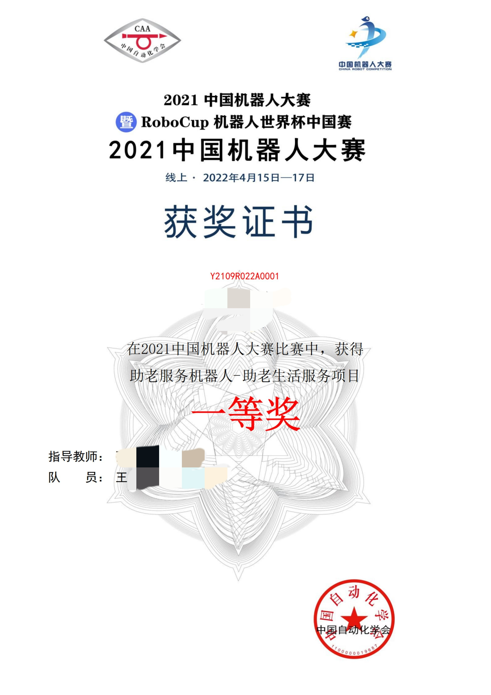

# RoboCup 2021 助老机器人赛道
中国机器人大赛国一(冠军)实现。  
由于本文档中有较多图片注释, 因此国内用户阅读本文档时应注意使用上网工具后再进行阅读。  
# 获奖证书
<details>

</details>

# 使用本仓库
如果需要更改代码, 则建议直接fork本仓库。  
## 克隆建议:
由于本仓库已经拆分出多个子模块, <strong><font color='red'>直接下载zip会造成缺少子模块的情况。</font></strong>  
如需复现本项目, 则<strong><font color='red'>必须</font></strong>使用git完成。  
git clone时需使用以下命令:  
```Powershell
git clone https://github.com/h13-0/RoboCup.git
git submodule update --init
```

# 渲染图


# 项目构成
本项目主要分为三个板块:  
1. STM32板块
2. 图像处理板块
3. 机械设计

## STM32板块
参考:  
[STM32](./STM32/)  

## 图像处理板块
参考:  
[图像处理](./ImageProcessing)  

## 机械设计
参考:  
[机械设计](./Machine/)

## 上位机调参
上位机使用[VOFA+](https://www.vofa.plus/)
配置文件见[VOFAConfig](/HostComputer/VOFAConfig/)
