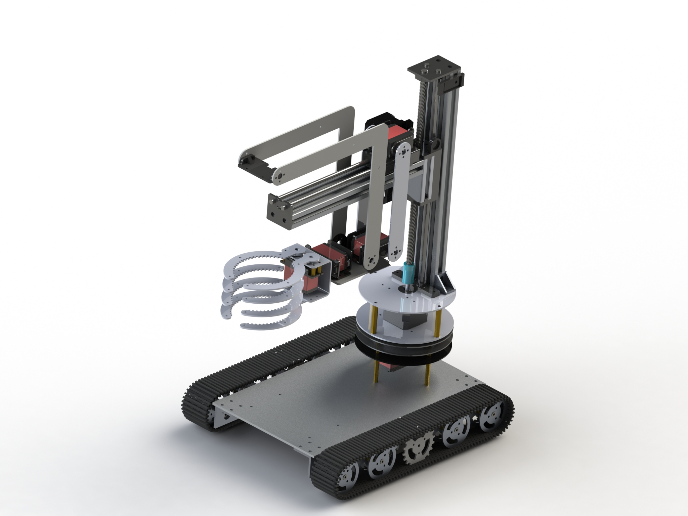

# RoboCup 2021 助老机器人赛道
# 渲染图

# 实拍图

# 项目构成
本项目主要分为三个板块:  
1. STM32板块
2. 图像处理板块
3. 机械设计

## STM32板块
参考:  
[STM32](./STM32/Readme.md)  

## 图像处理板块
参考:  
[图像处理](./ImageProcessing/Readme.md)  

## 机械设计
参考: 
[机械设计](./Machine/Readme.md)

## 上位机调参
上位机使用[VOFA+](https://www.vofa.plus/)
配置文件见[VOFAConfig](/HostComputer/VOFAConfig/Readme.md)
